## Software Design Document (SDD) — Alumni Association Platform (MERN)

### Introduction

#### Purpose of the system
The Alumni Association Platform connects alumni, students, and administrators within a unified portal to facilitate mentorship, job opportunities, workshops, blogs, announcements, and communications. It provides role-based dashboards, secure authentication, and admin oversight for content and users.

#### Scope of the project
- Web application with role-based experiences for Alumni, Students, and Admins
- Features: Authentication, Job Portal, Mentorship System, Workshops, Blogs, Announcements/Notifications, Admin Dashboard
- MERN stack with JWT-based authentication and deployment on Render/Vercel with MongoDB Atlas

#### Definitions, acronyms, and abbreviations
- **MERN**: MongoDB, Express.js, React.js, Node.js
- **JWT**: JSON Web Token
- **RBAC**: Role-Based Access Control
- **CRUD**: Create, Read, Update, Delete
- **API**: Application Programming Interface
- **SDD**: Software Design Document
- **UI/UX**: User Interface/User Experience

#### Overview of the document
This SDD covers architecture, module designs, data flows, database schema, API design, frontend design, workflows, security, non-functional requirements, deployment, and future enhancements.

---

## System Architecture

### High-level architecture diagram
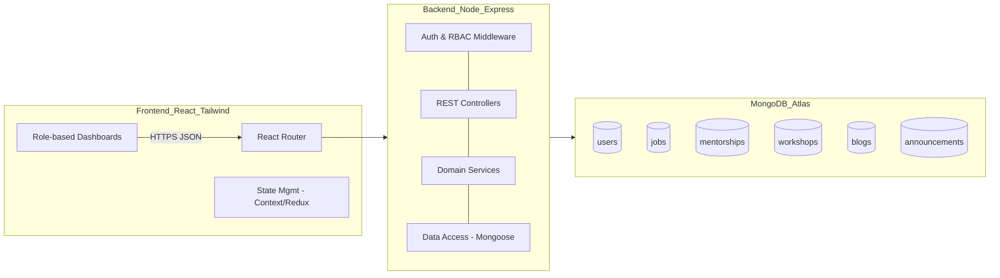

### API communication flow
- Client sends HTTPS requests with `Authorization: Bearer <JWT>` when authenticated.
- Express routes → auth middleware (JWT verify) → RBAC guard (role check) → controllers → services → repositories (Mongoose) → MongoDB.
- Responses: standardized JSON envelopes with `data`, `error`, `meta`.

### Role-based access control (RBAC) model
- Roles: `ADMIN`, `ALUMNI`, `STUDENT`
- Permissions matrix:
  - Authentication: All can sign up/login; Admins created by Admins or seeded.
  - Jobs: Alumni CRUD own; Students read/apply; Admin full oversight.
  - Mentorship: Alumni create/accept/reject; Students request; Admin monitor and intervene.
  - Workshops/Blogs: Alumni create/manage; Students read/comment; Admin moderate/remove.
  - Announcements: Admin create/manage; visible to all.
  - Admin Dashboard: Admin only.

### Component diagram and interactions
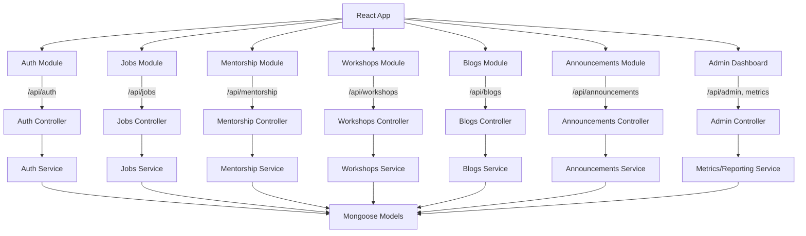

---

## Module Design

### Data Flow Diagrams

Level 0 (Context)
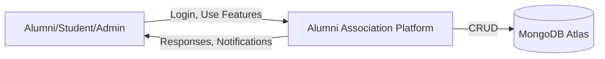

Level 1 (Key flows)
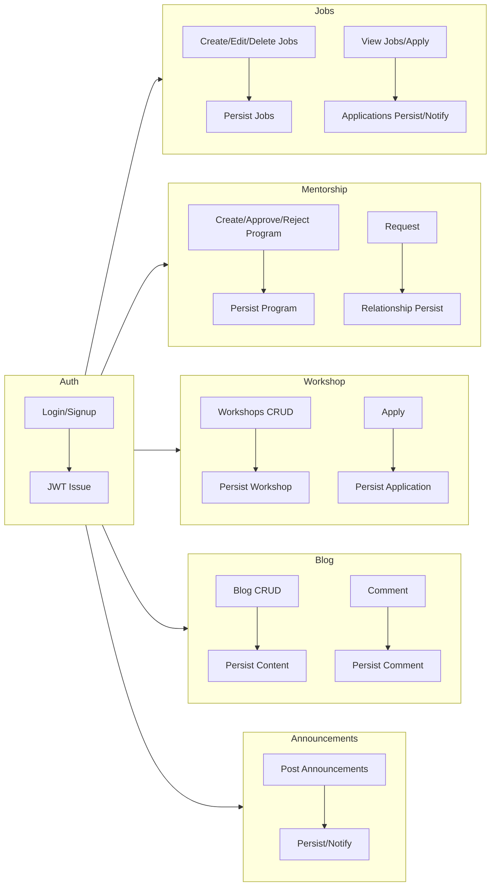

Level 2 (Example: Job Apply)
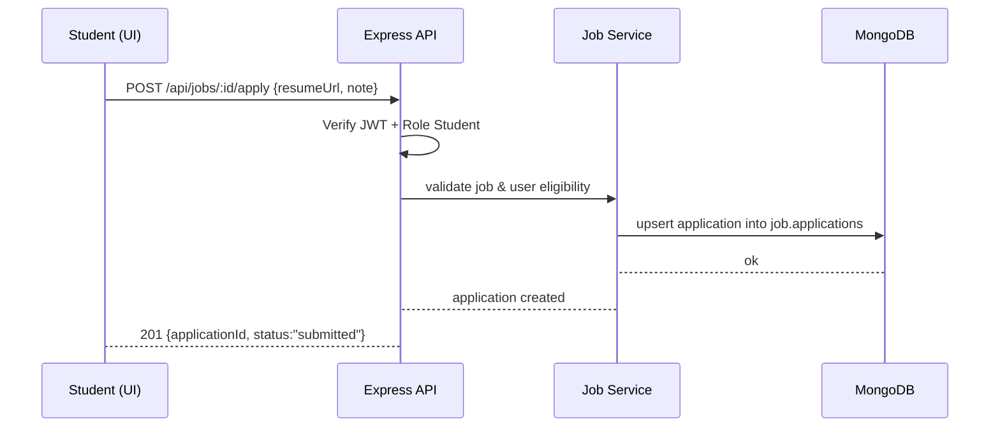

### Sequence diagrams (critical interactions)

Job posting (Alumni)
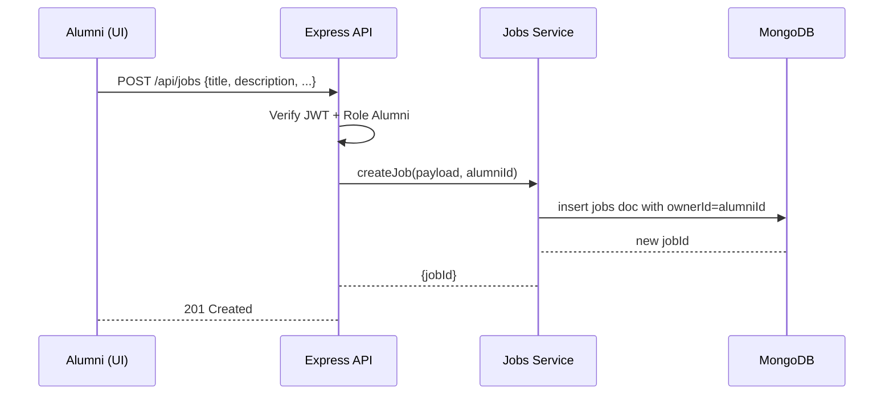

Mentorship request approval
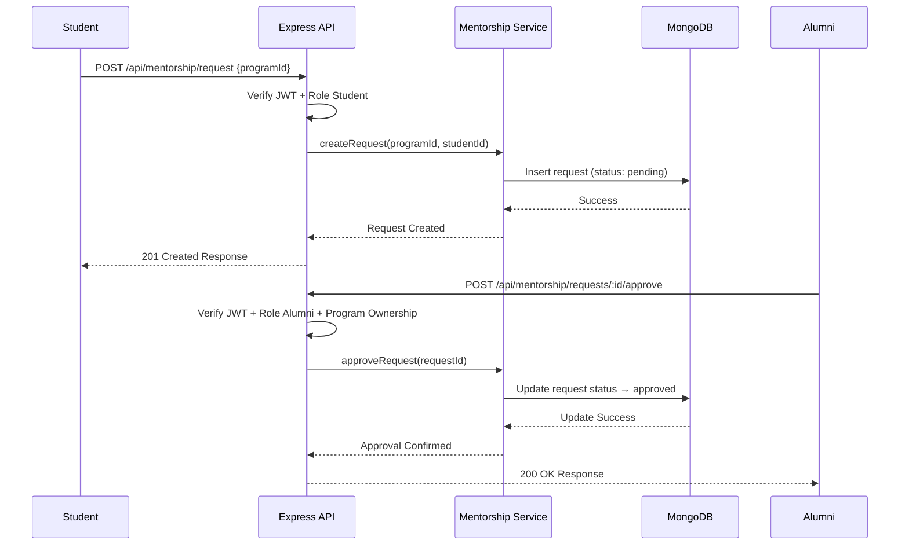

### Functional modules

- **Authentication & Roles**
  - JWT auth with email/password; bcrypt password hashing; optional refresh token; role claims in JWT.
  - Middlewares: `requireAuth`, `requireRole(roles)`.
- **Job Portal**
  - Alumni: CRUD own jobs; attach company, location, tags, application options; view applicants.
  - Students: browse/filter/search; apply with resume link/file; withdraw.
  - Admin: view all, remove inappropriate jobs.
- **Mentorship**
  - Alumni: define mentorship programs (topics, capacity, duration); approve/reject student requests; manage active mentees.
  - Students: browse programs; send requests; see status.
  - Admin: oversee queue, handle disputes.
- **Workshops & Blogs**
  - Alumni: create, edit, delete workshops (schedule, capacity) and blogs (rich text, tags).
  - Students: view, register (workshops), comment (blogs).
  - Admin: moderation tools.
- **Announcements & Notifications**
  - Admin: post, schedule, and archive announcements; visible globally; optional email/push in future.
- **Admin Dashboard**
  - Metrics: total users, active mentorships, job listings, workshop participation.
  - Management: Users, jobs, mentorships, announcements CRUD; role changes.

---

## Database Design

### ER Diagram (Collections)
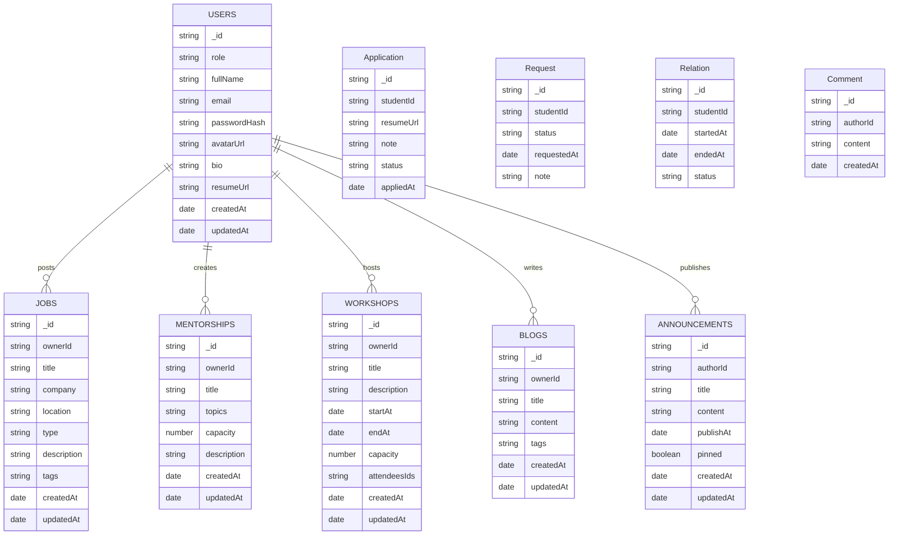

### Example schema structures (Mongoose-like)

```json
// users
{
  "_id": "ObjectId",
  "role": "ALUMNI",
  "fullName": "Jane Doe",
  "email": "jane@alumni.edu",
  "passwordHash": "bcrypt-hash",
  "avatarUrl": "https://...",
  "bio": "Frontend engineer...",
  "resumeUrl": null,
  "createdAt": "2025-10-10T12:00:00.000Z",
  "updatedAt": "2025-10-10T12:00:00.000Z"
}
```

```json
// jobs
{
  "_id": "ObjectId",
  "ownerId": "ObjectId",
  "title": "Frontend Engineer",
  "company": "Acme Corp",
  "location": "Remote",
  "type": "Full-time",
  "description": "Role details...",
  "tags": ["react", "frontend"],
  "applications": [
    {
      "_id": "ObjectId",
      "studentId": "ObjectId",
      "resumeUrl": "https://...",
      "note": "Excited to apply",
      "status": "submitted",
      "appliedAt": "2025-10-12T12:00:00.000Z"
    }
  ],
  "createdAt": "2025-10-10T12:00:00.000Z",
  "updatedAt": "2025-10-11T12:00:00.000Z"
}
```

```json
// mentorships
{
  "_id": "ObjectId",
  "ownerId": "ObjectId",
  "title": "Web Dev Mentorship",
  "topics": ["JS", "React"],
  "capacity": 5,
  "description": "Mentorship details...",
  "requests": [
    { "_id": "ObjectId", "studentId": "ObjectId", "status": "pending", "note": "Interested", "requestedAt": "2025-10-10T12:00:00.000Z" }
  ],
  "relations": [
    { "_id": "ObjectId", "studentId": "ObjectId", "startedAt": "2025-10-12T12:00:00.000Z", "endedAt": null, "status": "active" }
  ],
  "createdAt": "2025-10-10T12:00:00.000Z",
  "updatedAt": "2025-10-10T12:00:00.000Z"
}
```

```json
// workshops
{
  "_id": "ObjectId",
  "ownerId": "ObjectId",
  "title": "Resume Workshop",
  "description": "Improve resumes",
  "startAt": "2025-10-20T17:00:00.000Z",
  "endAt": "2025-10-20T19:00:00.000Z",
  "capacity": 100,
  "attendeesIds": ["ObjectId", "ObjectId"],
  "createdAt": "2025-10-10T12:00:00.000Z",
  "updatedAt": "2025-10-10T12:00:00.000Z"
}
```

```json
// blogs
{
  "_id": "ObjectId",
  "ownerId": "ObjectId",
  "title": "Breaking into Tech",
  "content": "<p>...</p>",
  "tags": ["career", "advice"],
  "comments": [
    { "_id": "ObjectId", "authorId": "ObjectId", "content": "Great post!", "createdAt": "2025-10-12T12:00:00.000Z" }
  ],
  "createdAt": "2025-10-10T12:00:00.000Z",
  "updatedAt": "2025-10-10T12:00:00.000Z"
}
```

```json
// announcements
{
  "_id": "ObjectId",
  "authorId": "ObjectId",
  "title": "Alumni Meet 2025",
  "content": "Join us...",
  "publishAt": "2025-11-20T10:00:00.000Z",
  "pinned": true,
  "createdAt": "2025-10-10T12:00:00.000Z",
  "updatedAt": "2025-10-10T12:00:00.000Z"
}
```

---

## API Design

### Conventions
- Base URL: `/api`
- Auth: `Authorization: Bearer <JWT>`
- Responses:
```json
{ "data": {...}, "error": null, "meta": { "page": 1, "pageSize": 20, "total": 100 } }
```
or
```json
{ "data": null, "error": { "code": "VALIDATION_ERROR", "message": "..." } }
```

### Authentication
- POST `/api/auth/signup` (public) — create Student/Alumni
  - Body: `{ fullName, email, password, role }` (role ∈ STUDENT|ALUMNI)
- POST `/api/auth/login` (public)
  - Body: `{ email, password }`
  - Resp: `{ token, user: { _id, role, fullName, email } }`
- GET `/api/auth/me` (auth) — get profile
- POST `/api/auth/admin/create` (admin) — create admin

### Users
- GET `/api/users` (admin)
- GET `/api/users/:id` (auth: self or admin)
- PUT `/api/users/:id` (auth: self or admin)
- PUT `/api/users/:id/role` (admin)

### Jobs
- GET `/api/jobs` (auth optional; if private, auth required)
  - Query: `q`, `tags[]`, `location`, `type`, `page`, `pageSize`
- GET `/api/jobs/:id` (auth)
- POST `/api/jobs` (alumni)
  - Body: `{ title, company, location, type, description, tags[] }`
- PUT `/api/jobs/:id` (alumni owns or admin)
- DELETE `/api/jobs/:id` (alumni owns or admin)
- POST `/api/jobs/:id/apply` (student)
  - Body: `{ resumeUrl, note }`
- GET `/api/jobs/:id/applications` (alumni owns or admin)
- PUT `/api/jobs/:jobId/applications/:applicationId` (alumni owns or admin)
  - Body: `{ status }` (reviewed|accepted|rejected|withdrawn)

### Mentorship
- GET `/api/mentorship/programs` (auth)
- GET `/api/mentorship/programs/:id` (auth)
- POST `/api/mentorship/programs` (alumni)
  - Body: `{ title, topics[], capacity, description }`
- PUT `/api/mentorship/programs/:id` (alumni owns or admin)
- DELETE `/api/mentorship/programs/:id` (alumni owns or admin)
- POST `/api/mentorship/request` (student)
  - Body: `{ programId, note }`
- POST `/api/mentorship/requests/:id/approve` (alumni program owner or admin)
- POST `/api/mentorship/requests/:id/reject` (alumni program owner or admin)
- GET `/api/mentorship/relations` (alumni: own mentees; student: own relations; admin: all)
- POST `/api/mentorship/relations/:id/complete` (alumni owner or admin)

### Workshops
- GET `/api/workshops` (auth)
- GET `/api/workshops/:id` (auth)
- POST `/api/workshops` (alumni)
- PUT `/api/workshops/:id` (alumni owns or admin)
- DELETE `/api/workshops/:id` (alumni owns or admin)
- POST `/api/workshops/:id/register` (student)
- POST `/api/workshops/:id/unregister` (student or admin)

### Blogs
- GET `/api/blogs` (auth)
- GET `/api/blogs/:id` (auth)
- POST `/api/blogs` (alumni)
- PUT `/api/blogs/:id` (alumni owns or admin)
- DELETE `/api/blogs/:id` (alumni owns or admin)
- POST `/api/blogs/:id/comments` (auth)
  - Body: `{ content }`
- DELETE `/api/blogs/:blogId/comments/:commentId` (author or admin)

### Announcements
- GET `/api/announcements` (auth)
- POST `/api/announcements` (admin)
- PUT `/api/announcements/:id` (admin)
- DELETE `/api/announcements/:id` (admin)
- POST `/api/announcements/:id/pin` (admin)

---

## Frontend Design

### Component hierarchy (simplified)
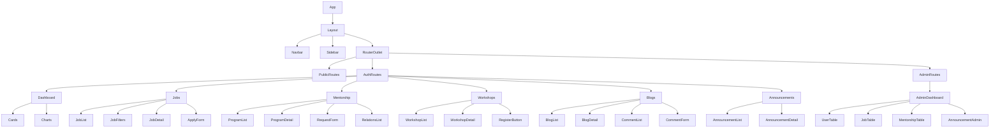

### Routing structure (React Router)
- `/` → Home or redirect to role dashboard
- `/login`, `/signup`
- `/dashboard` (auth)
- `/jobs`, `/jobs/:id`, `/jobs/:id/apply` (student)
- `/jobs/new`, `/jobs/:id/edit` (alumni/admin)
- `/mentorship/programs`, `/mentorship/programs/:id`
- `/mentorship/request` (student)
- `/mentorship/relations`
- `/workshops`, `/workshops/:id`, `/workshops/new`, `/workshops/:id/edit`
- `/blogs`, `/blogs/:id`, `/blogs/new`, `/blogs/:id/edit`
- `/announcements`
- `/admin` (admin)
  - `/admin/users`, `/admin/jobs`, `/admin/mentorships`, `/admin/announcements`

### State management flow
- Global auth state: user, token, role, isAuthenticated
- Feature slices/contexts: jobs, mentorship, workshops, blogs, announcements, metrics
- Async flows with `fetch`/Axios; loading/error states per slice
- Client-side cache/invalidation on CRUD actions

---

## Project Workflow

### Student
1. Signup → Login
2. View Jobs → Filter/Search → Open Job
3. Apply → Upload resume URL → Submit
4. Request Mentorship → Track request status
5. View Workshops → Register
6. Read Blogs → Comment
7. Read Announcements

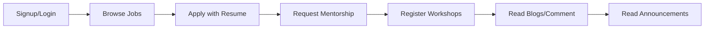

### Alumni
1. Login
2. Post Jobs → Manage Applications
3. Create Mentorship Program → Approve/Reject Requests
4. Host Workshops
5. Create Blogs
6. Moderate own content

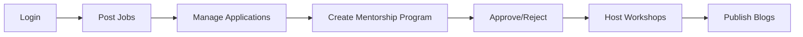

### Admin
1. Login
2. Manage Users, Jobs, Mentorships
3. Post Announcements
4. View Dashboard Insights and Moderate Content

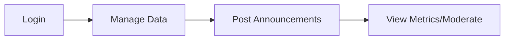

---

## Security and Authentication

### JWT structure
- Header: `{ "alg": "HS256", "typ": "JWT" }`
- Payload: `{ sub: userId, role: "ADMIN|ALUMNI|STUDENT", email, iat, exp }`
- Signature: HMAC SHA-256 with server secret `JWT_SECRET`
- Token lifespan: e.g., 1h access; optional refresh token strategy if implemented

### Middleware
- `requireAuth`: verify token, attach `req.user = { id, role, email }`
- `requireRole(allowedRoles)`: ensures `req.user.role` ∈ allowedRoles
- `ownershipGuard(getResourceOwnerId)`: checks resource owner matches `req.user.id` unless admin

### Password hashing
- `bcrypt` with salt rounds (e.g., 10-12)
- Compare on login; never store plaintext
- Rate-limit login endpoint; lockouts on repeated failures

### RBAC logic (examples)
- Jobs: Alumni can mutate only if `job.ownerId === req.user.id`; Admin bypass.
- Mentorship requests: Only program owner (alumni) or admin can approve/reject.
- Comments: Only author or admin can delete.

---

## Non-Functional Requirements

- **Performance**
  - P95 API latency < 300 ms for common reads; < 800 ms for complex writes
  - Pagination for lists; indexed fields (e.g., `jobs.title`, `jobs.tags`, `jobs.ownerId`)
- **Scalability**
  - Stateless backend; horizontal scaling on Render
  - MongoDB Atlas with auto-scaling; shard-ready schemas
- **Security**
  - HTTPS everywhere; secure cookies if using refresh tokens
  - Input validation (Joi/Zod) and sanitization (XSS-safe)
  - CORS configured to frontend origins
- **Maintainability**
  - Layered architecture (controllers/services/repos)
  - Linting, Prettier, typed JS/TS preferred
  - Modular routes per feature
- **Usability**
  - Responsive UI with Tailwind
  - Accessible components (ARIA), keyboard nav
  - Clear error messages and empty states

---

## Deployment Details

### Build commands
- **Frontend**
  - Install: `npm ci`
  - Build: `npm run build`
  - Env: `VITE_API_BASE_URL`
- **Backend**
  - Install: `npm ci`
  - Build (if TS): `npm run build` or run directly with Node
  - Start: `npm start`
  - Env:
    - `PORT`
    - `MONGODB_URI`
    - `JWT_SECRET`
    - `CORS_ORIGINS`
    - Optional: `LOG_LEVEL`, `NODE_ENV`

### Hosting
- **Frontend**: Vercel (static build) or Render
  - Configure `VITE_API_BASE_URL` to backend URL
- **Backend**: Render (Web Service)
  - Health check: `GET /health`
  - Auto-deploy on main branch
- **MongoDB**: MongoDB Atlas
  - IP access list: allow Render/Vercel egress
  - Create database user with least privilege
  - Collections: `users`, `jobs`, `mentorships`, `workshops`, `blogs`, `announcements`
  - Indexes:
    - `users.email` unique
    - `jobs.ownerId`, `jobs.title`, `jobs.tags`, `jobs.location`
    - `mentorships.ownerId`, `mentorships.topics`
    - `workshops.ownerId`, `workshops.startAt`
    - `blogs.ownerId`, `blogs.tags`
    - `announcements.publishAt`, `announcements.pinned`

---

## Future Enhancements

- Real-time chat between alumni and students (Socket.io)
  - Rooms per mentorship relation; typing indicators; message persistence
- Email notifications for mentorship responses
  - Provider (e.g., SendGrid); templated emails; digest settings
- Analytics dashboard for engagement tracking
  - Events: job applies, mentorship approvals, workshop registrations
  - Charts by time/role; cohort analysis
- Mobile app using React Native
  - Shared component library; API reuse; push notifications

---

## Appendix

### Example request/response bodies

Create Job (Alumni)
```json
POST /api/jobs
{
  "title": "Backend Engineer",
  "company": "Tech Co",
  "location": "Hybrid",
  "type": "Full-time",
  "description": "We build APIs...",
  "tags": ["node", "express", "mongodb"]
}
```
```json
201
{
  "data": { "_id": "6565...", "title": "Backend Engineer", "ownerId": "65ab..." },
  "error": null
}
```

Mentorship Request (Student)
```json
POST /api/mentorship/request
{
  "programId": "6533...",
  "note": "Interested in React mentoring"
}
```
```json
201
{
  "data": { "_id": "66ff...", "status": "pending" },
  "error": null
}
```

---

### RBAC matrix (summary)

| Feature          | Student           | Alumni                            | Admin            |
|------------------|-------------------|-----------------------------------|------------------|
| Auth             | Signup/Login      | Signup/Login                      | Create admins    |
| Jobs             | View, Apply       | CRUD own, view applicants         | Full CRUD        |
| Mentorship       | Request           | Create, Approve/Reject, Manage    | Full oversight   |
| Workshops        | View, Register    | CRUD own                          | Full CRUD        |
| Blogs            | View, Comment     | CRUD own                          | Full CRUD        |
| Announcements    | View              | View                              | CRUD             |
| Admin Dashboard  | -                 | -                                 | Access           |

---

References: See `alumni-association-platform/FUNCTIONALITY_SUMMARY.md` for feature-by-feature implementation notes.


